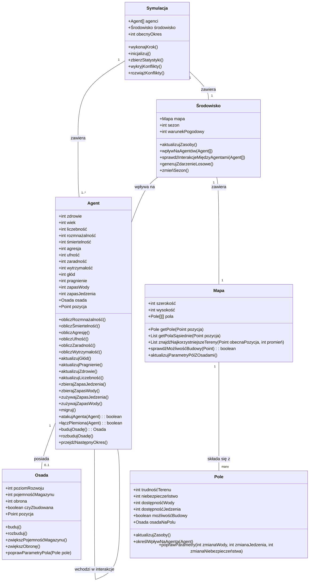

# Symulacja Agentowa

## Model Danych

Poniższy diagram UML przedstawia strukturę klas używaną w symulacji społeczeństw (agentów).



## Opis modelu

### Agent (społeczeństwo)
Agent reprezentuje społeczeństwo/plemię z parametrami takimi jak:
- **Parametry życiowe**: zdrowie, wiek, liczebność, rozmnażalność, śmiertelność
- **Parametry społeczne**: agresja, ufność, zaradność
- **Parametry zasobów**: zapas wody, zapas jedzenia, głód, pragnienie
- **Parametry mobilności**: wytrzymałość, pozycja

### Osada
Agenci mogą budować osady, które poprawiają parametry pola, na którym się znajdują:
- Zwiększają dostępność wody i jedzenia
- Zmniejszają niebezpieczeństwo
- Zapewniają magazynowanie zasobów

### Mapa i pola
Mapa składa się z pól, gdzie każde pole ma własne parametry:
- Trudność terenu
- Niebezpieczeństwo
- Dostępność wody i jedzenia
- Możliwość budowy

### Środowisko
Zarządza warunkami globalnymi takimi jak:
- Sezon
- Warunki pogodowe
- Zdarzenia losowe

### Symulacja
Koordynuje działanie całego systemu, inicjalizuje agentów i środowisko, oraz wykonuje kroki symulacji.


### Zależności parametrów między sobą
# Parametry symulacji agentowej w formacie zależności

Wszystkie parametry mają wartość średnią 50, z wyjątkiem:
- Wiek (wartość średnia: 40)
- Sezon (wartości 1-4, reprezentujące cztery pory roku)

## Parametry Agenta

### Parametry życiowe

**Zdrowie**  
Opis: Kondycja fizyczna społeczeństwa na skali 1-100.  
Rośnie gdy (każdy czynnik osobno może spowodować wzrost):
- Głód < 30
- Pragnienie < 30
- Niebezpieczeństwo pola < 40
- Wiek < 35

Maleje gdy (każdy czynnik osobno może spowodować spadek):
- Głód > 70
- Pragnienie > 70
- Niebezpieczeństwo pola > 60
- Śmiertelność > 60
- Wiek > 45
- Warunki pogodowe > 80
- Po ataku innego agenta

Wpływa na:
- Rozmnażalność
- Zaradność
- Wytrzymałość
- Śmiertelność
- Liczebność

**Wiek**  
Opis: Czas istnienia społeczeństwa na skali 1-100, wartość średnia: 40.  
Rośnie gdy:
- Z każdym okresem symulacji (stały przyrost)

Maleje gdy:
- Liczebność rośnie (więcej młodych jednostek obniża średni wiek)

Formuła zmiany wieku:
```
NowyWiek = (AktualnyWiek * StareJednostki + MinimalnyWiek * NoweJednostki) / (StareJednostki + NoweJednostki)
```
gdzie MinimalnyWiek to najmniejsza możliwa wartość wieku dla nowych jednostek (np. 1).

Wpływa na:
- Zaradność
- Śmiertelność
- Zdrowie
- Rozmnażalność
- Agresję
- Ufność

**Liczebność**  
Opis: Ilość członków społeczeństwa na skali 1-100.  
Rośnie gdy:
- Rozmnażalność > 50
- Śmiertelność < 50

Maleje gdy:
- Śmiertelność > 50
- Rozmnażalność < 30

Formuła zmiany liczebności:
```
NowaLiczebność = Liczebność + (Liczebność * (Rozmnażalność/200)) - (Liczebność * (Śmiertelność/200))
```

Wpływa na:
- Maksymalny Zapas Jedzenia i Wody
- Skuteczność ataku
- Agresję
- Rozmnażalność
- Wiek
- Zaradność
- Głód
- Pragnienie
- Wytrzymałość

**Rozmnażalność**  
Opis: Zdolność społeczeństwa do wzrostu na skali 1-100.  
Rośnie gdy (każdy czynnik osobno zwiększa parametr):
- Zdrowie > 70
- Głód < 40
- Pragnienie < 40
- Liczebność między 30 a 90
- Wiek < 35 (młodsze społeczeństwa szybciej się rozmnażają)

Maleje gdy (każdy czynnik osobno zmniejsza parametr):
- Głód > 60
- Pragnienie > 60
- Zdrowie < 40
- Niebezpieczeństwo pola > 70
- Liczebność > 90 (przeludnienie)
- Liczebność < 30 (zbyt mała populacja)
- Wiek > 50 (starsze społeczeństwa wolniej się rozmnażają)

Wpływa na:
- Liczebność
- Wiek

**Śmiertelność**  
Opis: Częstotliwość zgonów w społeczeństwie na skali 1-100.  
Rośnie gdy (każdy czynnik osobno zwiększa parametr):
- Zdrowie < 40
- Głód > 80
- Pragnienie > 80
- Wiek > 45 (zwiększa się proporcjonalnie do wieku)
- Niebezpieczeństwo pola > 70
- Warunek Pogodowy > 80
- Agresja > 80 (konflikty wewnętrzne)

Maleje gdy (każdy czynnik osobno zmniejsza parametr):
- Zdrowie > 70
- Głód < 40
- Pragnienie < 40
- Niebezpieczeństwo pola < 30
- Wiek < 35

Wpływa na:
- Liczebność
- Zdrowie
- Wiek

### Parametry społeczne

**Agresja**  
Opis: Skłonność do ataku innych agentów na skali 1-100.  
Rośnie gdy (każdy czynnik osobno zwiększa parametr):
- Głód > 70
- Pragnienie > 70
- Liczebność > 80
- Ufność < 30
- Zaradność < 30
- Zapas Jedzenia < 30
- Zapas Wody < 30

Maleje gdy (każdy czynnik osobno zmniejsza parametr):
- Ufność > 70
- Zapas Jedzenia > 80
- Zapas Wody > 80
- Liczebność < 30
- Zdrowie < 30
- Zaradność > 70

Wpływa na:
- Prawdopodobieństwo ataku
- Szansę łączenia plemion
- Śmiertelność
- Ufność

**Ufność**  
Opis: Skłonność do współpracy na skali 1-100.  
Rośnie gdy (każdy czynnik osobno zwiększa parametr):
- Zapas Jedzenia > 80
- Zapas Wody > 80
- Niebezpieczeństwo pola < 40
- Zaradność > 70
- Zdrowie > 70

Maleje gdy (każdy czynnik osobno zmniejsza parametr):
- Niebezpieczeństwo pola > 60
- Agent został wcześniej zaatakowany
- Głód > 70
- Pragnienie > 70
- Agresja > 70
- Warunek Pogodowy > 80

Wpływa na:
- Szansę łączenia plemion
- Agresję
- Prawdopodobieństwo obrony przed atakiem

**Zaradność**  
Opis: Zdolność do pozyskiwania zasobów na skali 1-100.  
Rośnie gdy (każdy czynnik osobno zwiększa parametr):
- Wiek > 40 (doświadczenie - wzrasta proporcjonalnie z wiekiem)
- Zdrowie > 60
- Głód < 50
- Pragnienie < 50
- Liczebność > 40
- Przetrwanie okresu z wysokim Niebezpieczeństwem lub złym Warunkiem Pogodowym (mierzone jako liczba przetrwanych okresów z wartościami powyżej 70)

Maleje gdy (każdy czynnik osobno zmniejsza parametr):
- Zdrowie < 40
- Głód > 70
- Pragnienie > 70
- Liczebność < 30
- Warunek Pogodowy > 80

Wpływa na:
- Efektywność zbierania zasobów
- Zapas Wody
- Zapas Jedzenia
- Śmiertelność
- Zdrowie
- Głód
- Pragnienie
- Agresję

### Parametry zasobów

**Zapas Wody**  
Opis: Zgromadzone zasoby wody na skali 1-100.  
Rośnie gdy (każdy czynnik wpływa na tempo przyrostu):
- Dostępność Wody pola > 60
- Zaradność > 40
- Warunek Pogodowy sprzyja (np. deszcze)

Maleje gdy (każdy czynnik przyspiesza zużycie):
- Przez podstawowe zużycie (zależne od Liczebności)
- Podczas migracji (zwiększone zużycie, agent nie zbiera zasobów)
- Trudność Terenu > 70 podczas migracji
- Warunek Pogodowy nie sprzyja (np. upały)
- Dostępność Wody pola < 30

Wpływa na:
- Pragnienie
- Zdrowie
- Ufność
- Rozmnażalność
- Agresję
- Wytrzymałość

**Zapas Jedzenia**  
Opis: Zgromadzone zasoby jedzenia na skali 1-100.  
Rośnie gdy (każdy czynnik wpływa na tempo przyrostu):
- Dostępność Jedzenia pola > 60
- Zaradność > 40
- Warunek Pogodowy sprzyja

Maleje gdy (każdy czynnik przyspiesza zużycie):
- Przez podstawowe zużycie (zależne od Liczebności)
- Podczas migracji (zwiększone zużycie, agent nie zbiera zasobów)
- Trudność Terenu > 70 podczas migracji
- Warunek Pogodowy nie sprzyja
- Dostępność Jedzenia pola < 30

Wpływa na:
- Głód
- Zdrowie
- Ufność
- Rozmnażalność
- Liczebność
- Agresję
- Wytrzymałość

**Głód**  
Opis: Potrzeba pożywienia na skali 1-100.  
Rośnie gdy (każdy czynnik osobno zwiększa parametr):
- Zapas Jedzenia < 30
- Z upływem czasu (okresów)
- Wytrzymałość < 40
- Liczebność > 70 przy stałym zapasie
- Warunek Pogodowy nie sprzyja

Maleje gdy (każdy czynnik osobno zmniejsza parametr):
- Zapas Jedzenia > 60
- Agent zużywa zapasy
- Zaradność > 70

Wpływa na:
- Zdrowie
- Agresję
- Rozmnażalność
- Wytrzymałość
- Śmiertelność
- Ufność
- Zaradność

**Pragnienie**  
Opis: Potrzeba wody na skali 1-100.  
Rośnie gdy (każdy czynnik osobno zwiększa parametr):
- Zapas Wody < 30
- Z upływem czasu (okresów)
- Wytrzymałość < 40
- Liczebność > 70 przy stałym zapasie
- Warunek Pogodowy nie sprzyja (np. upały)

Maleje gdy (każdy czynnik osobno zmniejsza parametr):
- Zapas Wody > 60
- Agent zużywa zapasy
- Zaradność > 70
- Warunek Pogodowy sprzyja (np. deszcze)

Wpływa na:
- Zdrowie
- Agresję
- Rozmnażalność
- Wytrzymałość
- Śmiertelność
- Ufność
- Zaradność

### Parametry mobilności

**Wytrzymałość**  
Opis: Zdolność do przemieszczania się na skali 1-100.  
Rośnie gdy (każdy czynnik osobno zwiększa parametr):
- Agent nie przemieszcza się (ładowanie)
- Zdrowie > 70
- Zaradność > 60
- Zapas Jedzenia > 60
- Zapas Wody > 60

Maleje gdy (każdy czynnik osobno zmniejsza parametr):
- Podczas przemieszczania (25 punktów za jedną kratkę, modyfikowane przez Trudność Terenu)
- Zdrowie < 50
- Głód > 60
- Pragnienie > 60
- Trudność Terenu > 70 podczas migracji
- Warunek Pogodowy > 80
- Liczebność > 90 (zbyt duża grupa do efektywnego przemieszczania)

Wpływa na:
- Zasięg migracji
- Zużycie zasobów podczas migracji
- Prędkość przemieszczania się
- Zapotrzebowanie na wodę i jedzenie podczas migracji
- Głód
- Pragnienie

## Parametry Pola

**Trudność Terenu**  
Opis: Stopień trudności przemieszczania się na skali 1-100.  
Rośnie gdy (każdy czynnik osobno może zwiększyć trudność):
- Warunek Pogodowy > 80
- Sezon nie sprzyja (np. zima)

Maleje gdy (każdy czynnik osobno może zmniejszyć trudność):
- Warunek Pogodowy sprzyja
- Sezon sprzyja

Wpływa na:
- Efektywność migracji Agentów
- Zużycie zasobów podczas przemieszczania
- Zasięg migracji
- Wytrzymałość podczas podróży
- Niebezpieczeństwo
- Zapas Wody
- Zapas Jedzenia

**Niebezpieczeństwo**  
Opis: Poziom zagrożeń naturalnych i innych na skali 1-100.  
Rośnie gdy (każdy czynnik osobno może zwiększyć niebezpieczeństwo):
- Warunek Pogodowy osiąga ekstremalne wartości
- Sezon nie sprzyja
- Trudność Terenu > 80

Maleje gdy (każdy czynnik osobno może zmniejszyć niebezpieczeństwo):
- Warunek Pogodowy sprzyja
- Sezon sprzyja

Wpływa na:
- Śmiertelność Agentów
- Zdrowie Agentów
- Ufność
- Rozmnażalność
- Zaradność

**Dostępność Wody**  
Opis: Ilość wody możliwa do pozyskania na skali 1-100.  
Wartość bazowa pola, która:
- Zmniejsza się przy eksploatacji przez agenta
- Odnawia się z określoną prędkością w każdym okresie

Rośnie gdy (każdy czynnik osobno może zwiększyć odnawianie):
- Sezon sprzyja (np. pora deszczowa)
- Warunek Pogodowy sprzyja (np. deszcze)

Maleje gdy (każdy czynnik osobno może zmniejszyć odnawianie lub przyspieszyć zużycie):
- Sezon nie sprzyja (np. susza)
- Warunek Pogodowy nie sprzyja (np. upały)
- Nadmierne eksploatowanie przez Agentów (zależne od Liczebności)

Wpływa na:
- Możliwość zbierania Zapasu Wody
- Atrakcyjność pola dla migracji

**Dostępność Jedzenia**  
Opis: Ilość pożywienia możliwa do pozyskania na skali 1-100.  
Wartość bazowa pola, która:
- Zmniejsza się przy eksploatacji przez agenta
- Odnawia się z określoną prędkością w każdym okresie

Rośnie gdy (każdy czynnik osobno może zwiększyć odnawianie):
- Sezon sprzyja (np. lato)
- Warunek Pogodowy sprzyja

Maleje gdy (każdy czynnik osobno może zmniejszyć odnawianie lub przyspieszyć zużycie):
- Sezon nie sprzyja (np. zima)
- Warunek Pogodowy nie sprzyja
- Nadmierne eksploatowanie przez Agentów (zależne od Liczebności)

Wpływa na:
- Możliwość zbierania Zapasu Jedzenia
- Atrakcyjność pola dla migracji

## Parametry Środowiska

**Sezon**  
Opis: Aktualny sezon w symulacji (wartości 1-4, reprezentujące cztery pory roku).  
Zmienia się:
- Cyklicznie z upływem okresów symulacji

Wpływa na:
- Dostępność Wody na polach
- Dostępność Jedzenia na polach
- Warunek Pogodowy
- Trudność Terenu
- Niebezpieczeństwo

**Warunek Pogodowy**  
Opis: Aktualna pogoda na skali 1-100 (1=idealna, 100=katastrofalna).  
Rośnie gdy (każdy czynnik osobno może pogorszyć warunki):
- Losowo, z wpływem Sezonu

Maleje gdy (każdy czynnik osobno może poprawić warunki):
- Losowo, z wpływem Sezonu
- Po ekstremalnych warunkach (powrót do średniej)

Wpływa na:
- Dostępność Wody
- Dostępność Jedzenia
- Niebezpieczeństwo pól
- Trudność Terenu
- Zdrowie Agentów
- Wytrzymałość
- Śmiertelność
- Ufność

## Przyszłe rozszerzenia

### Osady (ficzer planowany w wersji 1.2)

W kolejnej wersji zostanie dodany system osad, który pozwoli agentom budować stałe siedliska. Osady będą oferować:

**Poziom Rozwoju** - ogólny poziom zaawansowania osady, wpływający na jej możliwości  
**Pojemność Magazynu** - zwiększająca maksymalną ilość zasobów możliwą do przechowania  
**Obrona** - zmniejszająca niebezpieczeństwo pola i skuteczność ataków innych agentów

Osady będą poprawiać parametry pola, na którym się znajdują, zwiększając dostępność zasobów i zmniejszając niebezpieczeństwo.

Zaradność agenta będzie wpływać nie tylko na pozyskiwanie zasobów, ale również na zdolność do budowy i ulepszania osad.
