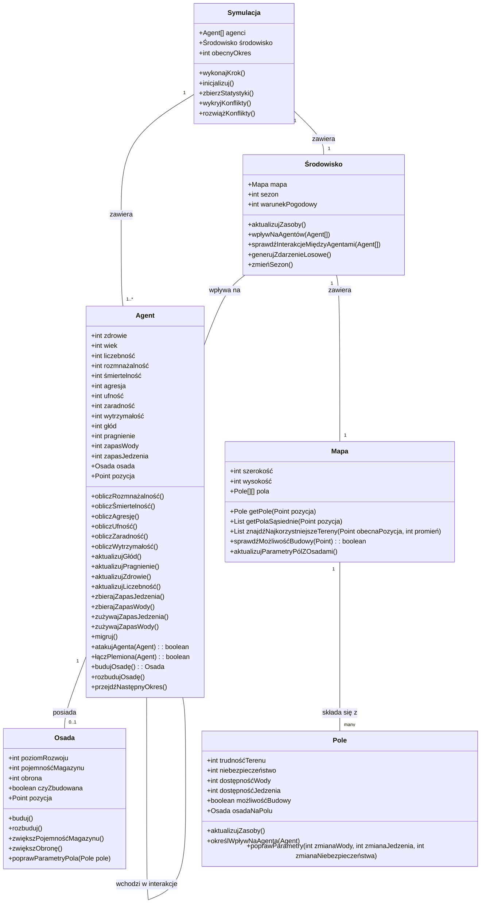

# Symulacja Agentowa

## Model Danych

Poniższy diagram UML przedstawia strukturę klas używaną w symulacji społeczeństw (agentów).

## Opis modelu

### Agent (społeczeństwo)
Agent reprezentuje społeczeństwo/plemię z parametrami takimi jak:
- **Parametry życiowe**: zdrowie, wiek, liczebność, rozmnażalność, śmiertelność
- **Parametry społeczne**: agresja, ufność, zaradność
- **Parametry zasobów**: zapas wody, zapas jedzenia, głód, pragnienie
- **Parametry mobilności**: wytrzymałość, pozycja

### Osada
Agenci mogą budować osady, które poprawiają parametry pola, na którym się znajdują:
- Zwiększają dostępność wody i jedzenia
- Zmniejszają niebezpieczeństwo
- Zapewniają magazynowanie zasobów

### Mapa i pola
Mapa składa się z pól, gdzie każde pole ma własne parametry:
- Trudność terenu
- Niebezpieczeństwo
- Dostępność wody i jedzenia
- Możliwość budowy

### Środowisko
Zarządza warunkami globalnymi takimi jak:
- Sezon
- Warunki pogodowe
- Zdarzenia losowe

### Symulacja
Koordynuje działanie całego systemu, inicjalizuje agentów i środowisko, oraz wykonuje kroki symulacji.
